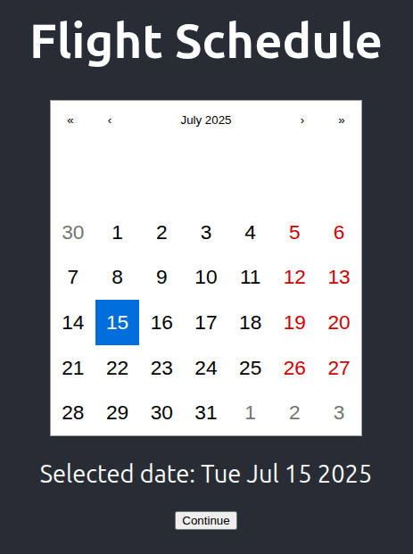

# ✈️ Flight Schedule App (React)

This project was completed as part of the **Skyscanner Front-End Software Engineering Job Simulation on Forage**.

---

## 📋 Task Objectives

As part of the simulation, I was asked to:

1. Update the app header to **"Flight Schedule"**
2. Install and integrate a calendar component
3. Display the calendar in the main view
4. Add a **"Continue"** button below the calendar
5. Run and pass a basic automated test to verify functionality

---

## 🚀 How to Run the App

1. Clone the repo or download the project files
2. Open a terminal and navigate into the project directory:

   cd my-app

3. Install dependencies:

   npm install

4. Start the app:

   npm start

5. Open your browser to:

   http://localhost:3000

---

## 🧪 Running Tests

This project includes a test file (App.test.js) that checks whether the app renders the "Flight Schedule" heading successfully.

To run the test:

    npm test

---

## 🛠️ Technologies Used

- React
- react-calendar
- Jest & React Testing Library
- HTML & CSS (via App.css)

---

## 📄 What’s Inside

- App.js — updated with calendar and button
- App.test.js — includes a working unit test for the heading

---

## 📸 Preview

Here's what the app shows:

---

## 💡 Note

- This app is for educational/demo purposes and doesn't connect to real flight data.

---

## 👨‍💻 About the Project

This simulation replicates a realistic developer task at Skyscanner, requiring component integration and test verification. It's designed to showcase front-end skills in a practical, job-like setting.
